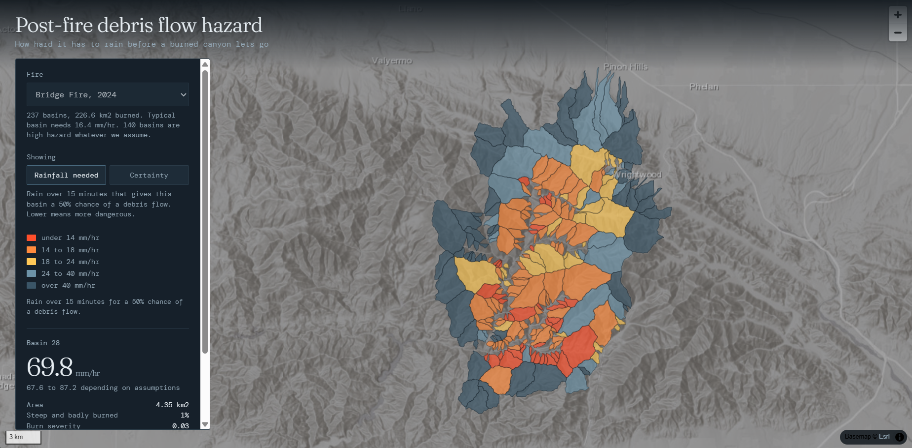

# Scar Threshold

**How hard it has to rain before a burned canyon lets go.**

### [Open the map](https://scar-threshold.pages.dev/)

[](https://scar-threshold.pages.dev/)

---

After a wildfire, a short burst of rain can turn a burned hillside into a fast slurry of mud and rock. It usually happens in the first winter, and often from a storm that would be unremarkable on unburned ground.

This pipeline takes satellite imagery, elevation and soil data for a burn scar, splits the terrain into drainage basins, and reports for each one the rainfall intensity that gives it a 50% chance of producing a debris flow. Built for the 2024 Bridge Fire in the San Gabriel Mountains: 237 basins, all from public data, running end to end in a browser.

The model is not the contribution. USGS publishes both the equations and a reference implementation. What this project offers is the ingest, the validation and the delivery, plus an uncertainty analysis that operational assessments do not publish.

## Three results

**The implementation is exact.** Given identical inputs, this project's model matches `pfdf.models.staley2017`, the official USGS package, bit for bit across 1,422 forward evaluations and 237 inverse solves. It also reproduces the published USGS assessment for this fire to floating point precision on all 703 pieces of burned ground. The comparison was then deliberately broken to confirm it was capable of failing.

**The disagreement with USGS is traceable.** The two assessments agree on where the hazard is: 99.8% of the ground USGS rates high is rated high here. They differ on magnitude by 7.7 mm/hr, and that gap decomposes into terrain, soil and burn severity, with each contribution measured. Delineation scale was tested across a 25-fold range and ruled out.

**The answer is robust to assumptions, but not to inputs.** Across six combinations of severity threshold and soil rule, the typical basin's threshold moves by 1.70 mm/hr and only 17 of 237 basins change hazard class. Substituting the field-validated BAER soil burn severity map moves 87 basins outside that envelope and none the other way, so the pipeline runs conservative: on this fire it over-warns and never under-warns. Every basin it rates safe is confirmed safe by field observation.

## The Bridge Fire

56,281 acres, ignited 8 September 2024. Sentinel-2 puts 76.5% of it at moderate or high burn severity, and 83.0% of it is steeper than 23 degrees. The median basin needs **16.4 mm/hr** of 15-minute rainfall for a coin-flip chance of a debris flow, which is not a remarkable storm in southern California.

## What is here

```
src/debrisflow/     the pipeline: severity, terrain, basins, soils, model
tests/              184 tests
00 to 04 .ipynb     Colab notebooks: ingest, USGS comparison, sensitivity
web/                the map
```

Data sources: Sentinel-2 via the Planetary Computer, USGS 3DEP 10 m elevation, USDA STATSGO soils, CAL FIRE FRAP perimeters, USDA Forest Service BAER soil burn severity. No API keys, no paid services.

## Run it

```bash
pip install -r requirements.txt
python -m pytest -q          # 184 passed
```

Or open `00_model_driver.ipynb` in Colab, which clones this repository and runs everything. `01_bridge_fire_ingest.ipynb` is the full ingest and takes considerably longer, since it reads satellite imagery and queries three external services.

## More

- **[METHODS.md](METHODS.md)** for the full method, every design decision, the validation in detail and the known limitations
- Staley, D.M. and others (2017), *Prediction of spatially explicit rainfall intensity-duration thresholds for post-fire debris-flow generation in the western United States*, Geomorphology 278, 149-162
- [USGS `pfdf`](https://code.usgs.gov/ghsc/lhp/pfdf), the authoritative implementation. This project's model is an independently tested reimplementation for cross-checking, not a replacement.
